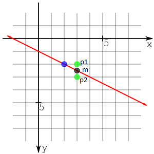

  # Algoritmo de Bresenham para rasterização de retas

  O projeto aqui apresentado foi uma atividade avaliativa solicitada aos alunos da Universidade Federal da Paraíba(UFPB) pela disciplina de Introdução à Computação Gráfica. Cada aluno deveria, de forma individual, implementar o **algoritmo de Bresenham**[1] para rasterização de linhas usando um *framework* escrito em linguagem C/C++ pelo professor da disciplina, com o objetivo de "simular" a escrita no *FrameBuffer* com o *OpenGL*.
  
  ## O *framework*
  
  Os arquivos que compõem o *framework* são:
  
  * definitions.h
  * main.cpp
  * main.h
  * Makefile
  * mysql.h
  
  O arquivo definitions.h contém a declaração das constantes que determinam a dimensão da tela(resolução) e o ponteiro (FBptr) para o início da memória de vídeo (mais especificamente, o início da região do framebuffer). A primeira posição de memória, apontada por FBptr, corresponde ao pixel da posição (0,0), canto superior esquerdo da tela. Cada pixel possui 4 componentes de cor (RGBA), cada
uma representada por 1 byte (unsigned char).
  O arquivo main.cpp contém o programa principal e a declaração da função MyGlDraw(), de onde as funções de rasterização a serem criadas devem ser chamadas.
  O arquivo main.h contém a definição de algumas funções de auxílio na simulação do acesso à memória de vídeo e ao seu scan.
  O arquivo Makefile que acompanha o framework é um script para compilação do sistema no ambiente Unix. A conversão do código para compilação em ambiente Windows é responsabilidade do aluno.
  
  ### Dependências
  
  A compilação do projeto exige que os cabeçalhos do OpenGL e a GLUT(*The OpenGL Toolkit*) estejam instalados.
  
  ### O algoritmo
  
  O algoritmo de Bresenham realiza a rasterização de segmentos de reta empregando apenas operações de aritmética de inteiros e, portanto, permite um maior desempenho computacional. O algoritmo baseia-se no critério do ponto médio. Consideremos a uma linha reta que intersepta duas colunas de píxeis. Para cada coluna de píxeis existem dois píxeis que se encontram mais próximos da reta, um abaixo e outro acima desta. A questão é determinar qual dos píxels deve ser selecionado dado a limitação de precisão física no dispositivo de vídeo. Se atentarmos na localização do ponto médio **(m)** entre os dois píxeis em relação à reta, teremos uma forma simples de determinar qual dos píxeis deve ser selecionado. Se o ponto médio se encontrar abaixo da reta, deve ser selecionado o píxel imediatamente acima desta **(p1)**. Caso contrário, o píxel a selecionar deverá ser o píxel imediatamente abaixo desta **(p2)**. E mais ainda, se o ponto médio está "encima" da reta, a escolha de qual píxel selecionar é arbitrária.
  
  
  
  Para determinar o ponto médio da reta, consideremos a a forma implícita da equação de um reta que é:
  
  *F(x, y) = ax + by + c*
  
  Onde,
  
  a = y<sub>final</sub> - y<sub>inicial</sub>
  
  b = - (x<sub>final</sub> - x<sub>inicial</sub>)
  
  c = (x<sub>final</sub> - x<sub>inicial</sub>).b
  
  Desta forma, dado um ponto *P(x, y)*, *F(x, y) ≠ 0* se P não está na reta.
  
  Assim,  podemos descobrir se o ponto médio, dado por *F(x<sub>0</sub>+1, y<sub>0</sub>+1/2)* está ou não na reta. Além disso, se *F(x<sub>0</sub>+1, y<sub>0</sub>+1/2)* for positivo o ponto está acima da reta. Caso contrário, se negativo, ele está abaixo da reta.
  Esta informação é importante para a decisão de qual pixel será selecionado pois, como já foi citado acima, a posição do ponto médio em relação a reta, determina que píxel está mais próximo da reta. Porém, calcular se este ponto médio, para cada ponto médio entre os segmentos de reta, está ou não na reta(e se está acima ou abaixo dela) seria muito custoso computacionalmente. Uma alternativa para esse problema é utilizar a distância *D* entre o ponto médio e a origem de cada segmento de reta. 
  
  Assim,
  
  *D = F(x<sub>0</sub>, y<sub>0</sub>+1/2) - F(x<sub>0</sub>, y<sub>0</sub>) = a + (1/2).b
  
  assim como no metodo do ponto médio[3], se D é positivo, então *(x<sub>0</sub>+1, y<sub>0</sub>+1)*(píxel abaixo) é escolhido, senão *(x<sub>0</sub>+1, y<sub>0</sub>)*(píxel acima) é escolhido.
  a decisão para o segundo ponto pode ser escrita como:
  
  *D = F(x<sub>0</sub>+2, y<sub>0</sub>+1/2) - F(x<sub>0</sub>+1, y<sub>0</sub>+1/2) = a*
  
  *D = F(x<sub>0</sub>+2, y<sub>0</sub>+3/2) - F(x<sub>0</sub>+1, y<sub>0</sub>+1/2) = a+b
  
  Analogamente, se D é positivo, então *(x<sub>0</sub>+2, y<sub>0</sub>+1)*(píxel abaixo) é escolhido, senão *(x<sub>0</sub>+1, y<sub>0</sub>)*(píxel acima) é escolhido. Esta decisão pode ser generalizada acumulando o erro.
  
  O unico problema que ainda procisa ser resolvido é o termo *1/2* no valor inicial de *D*, que não é um número inteiro portanto representa um problema de desempenho do algoritmo. Como oque importa é apenas do sinal de *D*, podemos, sem perda de generalidade, multiplicar tudo por 2. 
  
  Finalmente, 
  
  *D<sub>inicial</sub> = 2a + b*
  
  Precisamos apenas percorrer a reta do ponto inicial ao final seguindo a regra da escolha de píxels com relação a *D*.
  
  ## A implementação
  
  Com o uso do *framework* em questão, os arquivos a serem modificados para a implementação da atividade são: mygl.h e main.cpp. Porém, optei por definir tipos de dados específicos apenas com o intuito de reduzir o número de parametros das assinaturas das funções escritas para a implementação do algoritmo de Bresenham.
  São eles:
  * Cor:
  ```C
    typedef struct{
      int r, g, b, a;
    }cor;
  ```
  * Ponto:
  ```C
    typedef struct{
      int x, y;
    }ponto;
  ```
  * Linha:
  ```C
    typedef struct{
      ponto a, b;
    }linha;
  ```
  * Triangulo:
  ```C
    typedef struct{
      linha a, b, c;
    }triangulo;
  ```
  As funções implementadas somam um total de 4. São elas:
  * PutPixel:
  ```C
  // Esta função plota um ponto no buffer de video com a cor RGBA passada como parametro
  void PutPixel(ponto p, cor c);
  ```
  * interpola:
  ```C
  // Esta função implementa a tecnica de goraud[2] para interpolar duas cores em uma reta
  cor (cor c1, cor c2, float p);
  ```
  
  * DrawLine:
  ```C
  // Esta é a função que implementa o algoritmo de Bresenham[1]
  void (linha l, cor c1, cor c2);
  ```
  * DrawTriangle:
  ```C
  // Esta função desenha um triangulo oco interpolando as cores c1, c2 e c3 dos vertices ao longo das 
  // arestas presentes na estrutura passada por parametro.
  void DrawTriangle(triangulo t, cor c1, cor c2, cor c3);
  ```
  
  
  O programa não é interativo e, não existindo entrada de dados no sistema, os valores são especificados em código antes da compilação.
  
  ## Discussão
  
  O algoritmo funciona de forma satisfatória. Quanto a minha implementação deste algortimo: A função DrawLine que é responsável pelo algoritmo de Bresenham em si, usa de recursividade para espelhar os quadrantes 2 e 3 nos 1 e 4 respectivamente. Esta escolha se dá tão somente pela facilidade do meu entendimento do algoritmo em relação ao artigo do mesmo[1]. Porém, do ponto de vista computacional, acredito que isto seja mais custoso, em termos de processamento, que uma versão "linear" do algoritmo. Uma análise assintótica posterior pode provar tal pressentimento. Porém, sem dúvidas, entender a aplicação do algoritmo para todos os octantes é a maior dificuldade da atividade, e neste sentido acredito que o objetivo foi cumprido.
  Além disso, acredito que a falta de interatividade pode não ser bem visto dado o teor acadêmico da atividade. Mas eu acredito que a modificação em código e recompilação do mesmo para teste se mostrou suficiente para entendimento, ao menos para mim.
  
  ## Referências
  [1]BRESENHAM, Jack E. Algorithm for computer control of a digital plotter. **IBM Systems journal**, v. 4, n. 1, p. 25-30, 1965.
  
  [2]http://www.alanzucconi.com/2016/01/06/colour-interpolation/ Acessado em 5 de setembro, 2017.
  
  [3]http://www.demic.fee.unicamp.br/~jeff/ArquivosIndex/Bresenham. Acessado em 5 de setembro, 2017.
  
  [3]https://en.wikipedia.org/wiki/Midpoint_method. Acessado em 5 de setembro, 2017.
