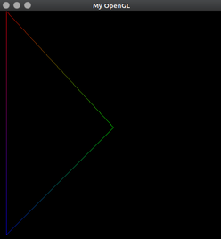

  # Algoritmo de Bresenham para rasterização de retas

  O projeto aqui apresentado foi uma atividade avaliativa solicitada aos alunos da Universidade Federal da Paraíba(UFPB) pela disciplina de Introdução à Computação Gráfica. Cada aluno deveria, de forma individual, implementar o **algoritmo de Bresenham**[1] para rasterização de linhas usando um *framework* escrito em linguagem C/C++ pelo professor da disciplina, com o objetivo de "simular" a escrita no *FrameBuffer* com o *OpenGL*.
  
  ## O *framework*
  
  Os arquivos que compõem o *framework* são:
  
  * definitions.h
  * main.cpp
  * main.h
  * Makefile
  * mysql.h
  
  O arquivo definitions.h contém a declaração das constantes que determinam a dimensão da tela(resolução) e o ponteiro (FBptr) para o início da memória de vídeo (mais especificamente, o início da região do framebuffer). A primeira posição de memória, apontada por FBptr, corresponde ao pixel da posição (0,0), canto superior esquerdo da tela. Cada pixel possui 4 componentes de cor (RGBA), cada
uma representada por 1 byte (unsigned char).
  O arquivo main.cpp contém o programa principal e a declaração da função MyGlDraw(), de onde as funções de rasterização a serem criadas devem ser chamadas.
  O arquivo main.h contém a definição de algumas funções de auxílio na simulação do acesso àmemória de vídeo e ao seu scan.
  O arquivo Makefile que acompanha o framework é um script para compilação do sistema no ambiente Unix. A conversão do código para compilação em ambiente Windows é responsabilidade do aluno.
  
  ### Dependências
  
  A compilaço do projeto exige que os cabeçalhos do OpenGL e a GLUT(*The OpenGL Toolkit*) estejam instalados.
  
  ## A implementação
  
  Com o uso do *framework* em questão, os arquivos a serem modificados para a implementação da atividade são: mygl.h e main.cpp. Porém, optei por definir tipos de dados específicos apenas com o intuito de reduzir o número de parametros das assinaturas das funções escritas para a implementação do algoritmo de Bresenham.
  São eles:
  * Cor:
  ```C
    typedef struct{
      int r, g, b, a;
    }cor;
  ```
  * Ponto:
  ```C
    typedef struct{
      int x, y;
    }ponto;
  ```
  * Linha:
  ```C
    typedef struct{
      ponto a, b;
    }linha;
  ```
  * Triangulo:
  ```C
    typedef struct{
      linha a, b, c;
    }triangulo;
  ```
  As funções implementadas somam um total de 4. São elas:
  * PutPixel:
  ```C
  void PutPixel(ponto p, cor c); // Esta função plota um ponto no buffer de video
  ```
  * interpola:
  ```C
  cor (cor c1, cor c2, float p); // Esta função implementa a tecnica de goraud[2] para interpolar duas cores
  ```
  
  * DrawLine:
  ```C
  void (linha l, cor c1, cor c2); // Esta é a função que implementa o algoritmo de Bresenham
  ```
  * DrawTriangle:
  ```C
  void DrawTriangle(triangulo t, cor c1, cor c2, cor c3); // Esta função apenas desenha um triangulo oco
  ```
  
  O programa não é interativo e, não existindo entrada de dados no sistema, os valores são especificados antes da compilação.
  
  ## Discussão
  
  O algoritmo funciona de forma satisfatória. Quanto a minha implementação deste algortimo: A função DrawLine que é responsável pelo algoritmo de Bresenham em si, usa de recursividade para espelhar os quadrantes 2 e 3 nos 1 e 4 respectivamente. Esta escolha se dá tão somente pela facilidade do meu entendimento do algoritmo em relação ao artigo do mesmo[1]. Porém, do ponto de vista computacional, acredito que isto seja mais custoso em termos de processamento que uma versão "linear" do algoritmo. Uma análise assintótica posterior pode provar tal pressentimento. Porém, sem dúvidas, entender a aplicação do algoritmo para todos os octantes é a maior dificuldade da atividade, e neste sentido acredito que o objetivo foi cumprido.
  Além disso, acredito que a falta de interatividade pode não ser bem visto dado o teor acadêmico da atividade. Mas eu acredito que a modificação do código e recompilação do mesmo para teste se mostrou suficiente para entendimento, ao menos para mim.
  
  ## Referências
  [1]BRESENHAM, Jack E. Algorithm for computer control of a digital plotter. **IBM Systems journal**, v. 4, n. 1, p. 25-30, 1965.
  [2]https://www.stack.nl/~dimitri/3dsview/gouraud.html. Acessado em 5 de setembro, 2017.
  [3]http://www.demic.fee.unicamp.br/~jeff/ArquivosIndex/Bresenham. Acessado em 5 de setembro, 2017.
